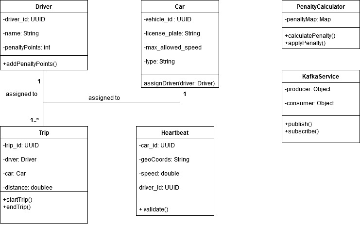
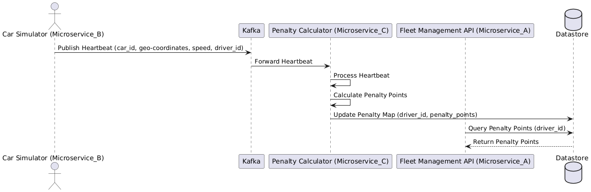
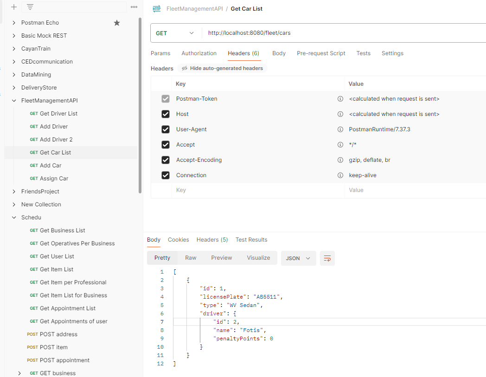
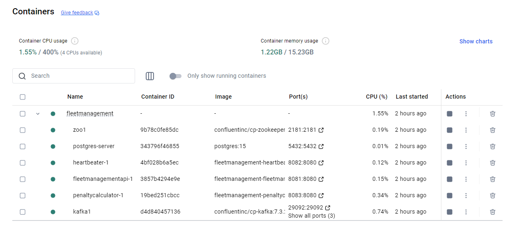
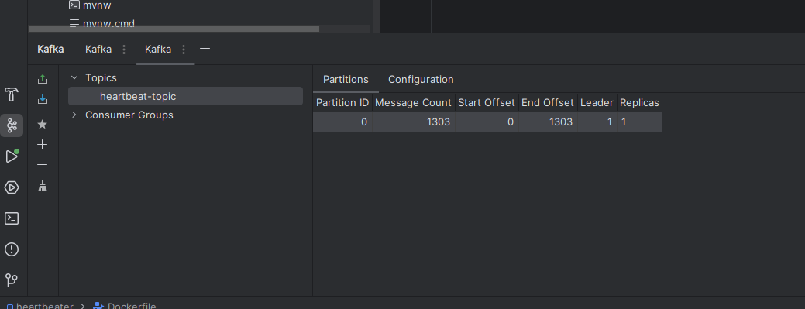

This project is done as a take home exercise that it's meant to be completed in a few hours. It needs to prove good code and good architecture. A good app is more like good code and good architecture, Security best practices, secure coding and scalability are also important. I'll try to cover all the additions that should be done in test of security and best practices here. I assume that a few hours are not enough to build a microservices environment therefore I'll try to explain the design and how this microservice will fit in a microservices environment and the position against the rest of the services.

DESIGN

This Class diagram illustrates a fleet management system. The key entities include Driver, Car, Trip, Heartbeat, PenaltyCalculator, and KafkaService. Drivers and cars have one-to-one relationships, while trips link multiple drivers to cars. PenaltyCalculator evaluates penalties for speed violations, and KafkaService handles message publishing and subscribing for events and updates. During the implementation I took the desision to simplify this design by remove Trip. The points are calculated on runtime.

Since this is a take home exercise and not a live coding exercise, I can't ask any questions therefore, all the decision need to be done asynchronously. I think the initial ask is to implement the REST API satisfying the functional requirements described and also showing good grasp of TDD and clean code principles  Given that this is meant to be completed in a few hours, I assume that the whole microservices environment is out of scope. However, I would like to propose a system design to have an idea where this service belongs.

In the beginning it needs to be clear thatREST APIs and microservices are related but distinct concepts in software architecture. This exercise asks for a REST API but you can't start implementing a REST API to be isolated from the rest of the planet.

Future Enhancements: Except to the core logic that is mostly included in this repo there's a plethora of future enhancements to add security, Scalability, Fault tolerance and extensibility.

* Logging (a logger service)
* More asynchronous workflows with Kafka and GRPC calls between services where request-response mode might be more efficient than asyncronous.
* Persistence with PostgreSQL/MongoDB for long-term storage

Extensibility:

* Monitoring or analytics using Elastic.

Thoughts and assumptions during analysis and design

* Should we have now or in the future a polymorphic behaviour for cars and drivers? Are we going to implement the system in countries that they have different max speed limits 
for different types of vehicles (car, motorcycle, lorry, bus) or for drivers of different age? (for example 17yrs, 18-21yrs) or even new drivers or more senior ones?
In this case we need a design where we have a base class (lets name it vehicle) and subclasses that inherit the same basic characteristics but they behave polymorphic in terms of max speed limits.
The exercise is very specific for the simplicity of the system so I decided to keep it simple.

* Should the system match driver_id, car_id in the system before transmitting the heartbit? In this case we probably need an request-respond communication between the REST API(microservice A)
 and the Heartbeat (microservice B) to ask if the driver and the car have an active surveillance senssion just to confirm that the Kafka message queue has only useful traffic and proccess time.
In this case we could have microservice B to use REST API and send HTTP request to Microservice A and ask if DriverID and CarID are valid. This solution is cheap since the REST is already 
implemented and we just reuse it for internal use but it's slower communication (which will let heartbeats accumulate). The other solution is to implement a gRPC for faster request - respond 
communication this is faster than HTTP.
However, if we have multiple cars and requests at the same time, or we need to track a trip if Microservice A is down (to repsond) we may have to think another Kafka communication with 2 different topics, between 
A and B, to send a track job for validation and then have a "responce" job with or without confirmation published in a different topic.
In this example I decided to assume that all Heartbeats are valid for process and keep things simple for this exercise.

* Althought Kafka is robust and has a great batching system implemented to make it's pull messages efficient, we may have to reconsider KAfka as a messaging system solution. In general for signals like heartbeat, we may need to implement a Push messaging mechanist using AMQP (like RabbitMQ or Redis)

Proposals for Future Additions in AuthN/AuthZ Authentication (AuthN) Enhancements :
* Token-Based Authentication: Implement JWT (JSON Web Tokens) for secure user authentication. Each user would authenticate using credentials and receive a token for subsequent API calls. Tokens will include expiry times to ensure they are short-lived for added security.
* OAuth2 Integration: Introduce third-party authentication providers (e.g., Google, GitHub) using OAuth2 for seamless and secure login. This reduces the need to manage user passwords directly.
* Password Management: Use secure hashing algorithms such as bcrypt or Argon2 for storing passwords if custom login functionality is introduced. Enforce strong password policies for additional security.
* Rate limiter: Maybe in the future if a secrewt santa goes public we need a rate limiter to mitigate attacks
* Authorization (AuthZ) Enhancements
* Role-Based Access Control, like admins to add/delete members, or someone to be have the right to shuffle
* Token Scopes and Permissions Use OAuth2 scopes to define permissions for each token

What is missing from this MVP that need to be added as soon as possible.

* Extensive Unit test and Mocks - Apart from the fact that unit tests are crucial to discover issues and confirm that any changes are safe and didn't broke something they are also useful for TDD. Here they are very crucial to enhance profiling tools like go leak, panic parse, pprof etc. There are some but in general I prefer ~100% coverage when I have the time to do it.
* Validate inputs - all inputs by users needs to be validated. Not only to avoid bad actors that may try (i.e. SQL injection). https://github.com/securego/gosec is good tool to check SQL injection, Hardcoded credentials, missing inputs etc.
* Extensive System test - There are some basic scenarios just as showcase, there's a need to cover any possible behaviour and added in CI/CD (etc github actions)
* Comments, I would definetely like to have more time to add more comments
* I would also like to fix some of the unitest that broken when I switched from h2 in memory datastore to postgress. However, in our email conversation we decide to send this over on Tuesday noon. I'll probably try to fix it later, so please consider 64a51e2b923d09ded5f16c5b3228a5151e776370 as the final submit (except to documentaion).

Misc

There's a Postman collection that you can import

At the moment it is set to the docker url's

Additionally there's a Kafka test tool installed for debbuging

